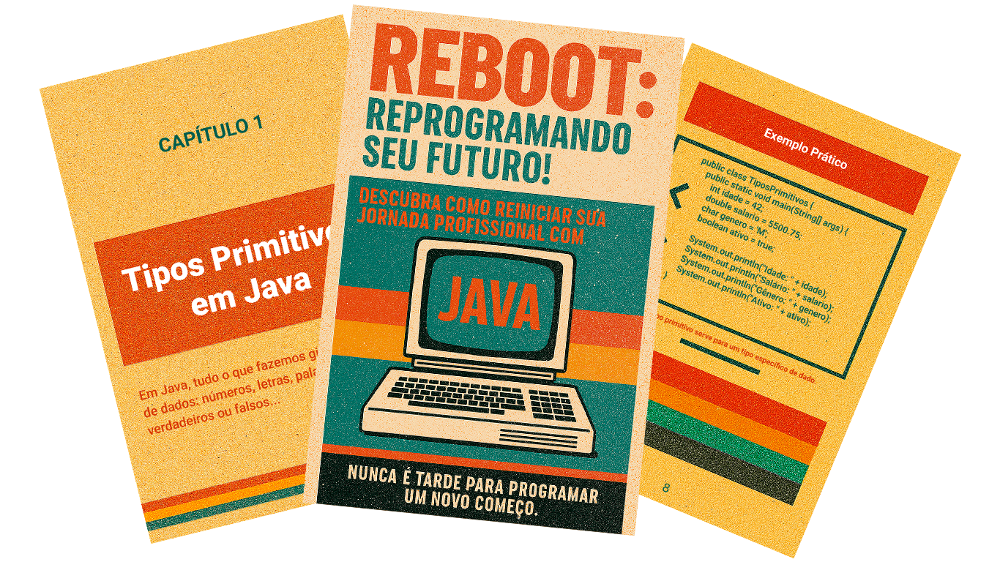

    

-------

# Projeto EBOOK Gerado por I.A.s

 > ℹ️ **NOTE:** Este é o repositório desenvolvido durante o curso Fundamentos de IA Generativa ministrado pela [DIO](https://dio.me)

Projeto com o objetivo de gerar um ebook digital com as facilidades das ferramentas de IA. todos os prompts
seguem abaixo.

<a href="output/ebook-java.pdf"> 📕Clique aqui para ler</a>

## 💻 Tecnologias utilizadas no projeto

- [ChatGPT](https://chat.openai.com/) 
- [MidJourney](https://www.midjourney.com/app/)
- [PowerPoint](https://www.microsoft.com/en/microsoft-365/powerpoint)

## 🧠 Prompts

ChatGPT：

|   Ação   | prompt                                                                                                                                                                                                                                                                         |
| :------: | ------------------------------------------------------------------------------------------------------------------------------------------------------------------------------------------------------------------------------------------------------------------------------ |
|  título  | Estou criando um ebook sobre java para iniciantes. Por isso, preciso que você sugira um título sobre o tema de java - o ebook é do nicho de programação e o subnicho é de java. sugira ao menos 5 titulos épicos e curtos, e que tenham uma temática retrô para novos estudantes com mais de 40 anos que estão em transição de carreira. |
| conteúdo | Agora preciso de um texto para o conteúdo, como foco em java, explicando para iniciantes os tipos primitivos do JAVA com exemplos de codigo seguindo as regras: {REGRAS} > Explique sempre de uma maneira simples > Deixe o texto enxuto > Sempre traga exemplos de codigos em contextos reais > Sempre apresente um bloco de conteúdo com um título adequado. |

Midjourney：

|  Ação  | prompt                                                                                 |
| :----: | -------------------------------------------------------------------------------------- |
| título | Crie uma imagem de uma capa para ebook com o titulo: "Reboot: Reprogramando seu futuro!" destinado a estudantes iniciantes com uma temática retrô para estudantes com mais de 40 anos que estão em transição de carreira. Reserve espaços para titulo(Reboot: Reprogramando seu futuro!), subtitulo(Descubra Como Reiniciar Sua Jornada Profissional com JAVA) e chamada para ação(Nunca é tarde para programar um novo começo.) |

## ✨ Features

- Conteúdo gerado via ChatGPT
- Imagens geradas via MidJourney

## 📚 Materiais

- Imagens utilizadas em `source`
- ebook gerado durante as aulas em `output`

## 🛠️ Instruções de execução

Utilize os prompts acima nas ferramentas sugeridas para gerar o material base e utilize uma ferramenta de edição de documentos como power point, libreoffice , indesign para diagramação.

## 👨‍💻 Expert

    
    
&nbsp&nbsp&nbspLeopoldo Barbato 
    &nbsp&nbsp&nbsp
    <a href="https://github.com/lbarbatto">
    GitHub</a>&nbsp;|&nbsp;
    <a href="https://www.linkedin.com/in/leopoldo-barbato/">LinkedIn</a>
&nbsp;|&nbsp;

  

---

⌨️ com 💜 por [Leopoldo Barbato](https://github.com/lbarbatto)
